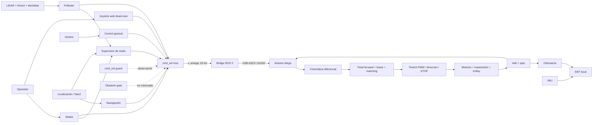

# Análisis integral del sistema de control

**Proyecto:** Smart Golf Trolley / Fairway Trolley OS  
**Organización:** SOTO-ROBOTICS  
**Fecha de la línea base analizada:** 2026-10-05  
**Estado:** Informe técnico de prototipo; no constituye certificación ni caso de seguridad.

## 1. Resumen ejecutivo

El trolley implementa un sistema de control distribuido y jerárquico:

1. El operador, el follower, los gestos, la navegación y el joystick web generan
   solicitudes de velocidad.
2. Un supervisor discreto determina el modo efectivo.
3. Un multiplexor selecciona una sola fuente fresca y limita su salida.
4. El bridge ROS 2 transmite velocidad lineal y angular al Arduino.
5. El firmware convierte la velocidad del cuerpo en velocidades de rueda,
   aplica feed-forward, compensaciones y PWM.
6. Hall, optoencoders, IMU, LiDAR superior, Kinect, GPS y corriente producen
   realimentación, diagnóstico o inhibiciones según su nivel de integración.

La arquitectura de autoridad es razonablemente conservadora: las fuentes no
publican directamente sobre la salida final, los datos caducados producen cero
y existen watchdogs escalonados. Sin embargo, la regulación física de velocidad
continúa siendo principalmente de lazo abierto. El PI por rueda está disponible
pero desactivado; la corrección de igualdad de ruedas solo trata el error
diferencial y no el error común de velocidad. En consecuencia, el sistema puede
ser estable desde el punto de vista lógico y aun así presentar error de
velocidad, trayectoria o distancia bajo cambios de carga, pendiente, césped,
batería y fricción.

Las funciones `cmd_vel_guard` y `obstacle_gate_core` no forman parte de la ruta
de actuación. El primero solo observa y el segundo es lógica prototipo no
conectada. El LiDAR inferior fue retirado de la configuración física activa y
su puerto se reasignó a la cámara ELP. Por tanto, no deben
acreditarse como funciones automáticas de parada.

### Conclusión principal

La línea base es apropiada para desarrollo supervisado y ensayos progresivos,
pero aún no para operación autónoma sin supervisión. La prioridad técnica no es
aumentar ganancias: es identificar la planta cargada, cerrar y validar los
lazos de rueda, medir retardos y distancias de parada, incorporar el obstáculo
al camino autorizado y añadir una parada eléctrica independiente.

## 2. Alcance y fuentes de evidencia

El análisis comprende:

- Control humano por Stadia y joystick web.
- Modos FOLLOWER, GESTURE y navegación.
- Supervisor de campo y multiplexor de velocidad.
- Bridge ROS 2–Arduino y protocolo serie.
- Cinemática diferencial.
- Feed-forward, rampa, arranque, inversión y PWM.
- Hall, optoencoders, IMU, EKF, LiDAR superior, Kinect, GPS y cámara ELP de
  análisis, esta última fuera del lazo de control.
- Watchdogs, STOP, restauración del stack y recuperación ante fallos.
- Integración mecánica, alimentación y condiciones ambientales.

Fuentes principales:

- [`follower_params.yaml`](simulation_ws/src/robot_follower/config/follower_params.yaml)
- [`field_supervisor_core.py`](simulation_ws/src/robot_follower/robot_follower/field_supervisor_core.py)
- [`cmd_vel_mux.py`](simulation_ws/src/robot_follower/robot_follower/cmd_vel_mux.py)
- [`cmd_vel_guard.py`](simulation_ws/src/robot_follower/robot_follower/cmd_vel_guard.py)
- [`follower_node.py`](simulation_ws/src/robot_follower/robot_follower/follower_node.py)
- [`arduino_node.py`](simulation_ws/src/arduino_bridge_ros2/arduino_bridge_ros2/arduino_node.py)
- [`stadia_node.py`](simulation_ws/src/arduino_bridge_ros2/arduino_bridge_ros2/stadia_node.py)
- [`encoder_fusion.py`](simulation_ws/src/arduino_bridge_ros2/arduino_bridge_ros2/encoder_fusion.py)
- [`ROS2_Bridge.h`](ROS2_Bridge.h)
- [`Motor_Control.h`](Motor_Control.h)
- [`Robot_States.h`](Robot_States.h)
- [`Configuration.h`](Configuration.h)
- [`SMOOTH_BENCH_20260910.md`](simulation_ws/SMOOTH_BENCH_20260910.md)
- [`HANDOVER.md`](HANDOVER.md)

Los valores históricos de V13 y las copias de respaldo no se emplean como
configuración activa.

## 3. Objetivos de control

| Objetivo | Variable controlada u observada | Referencia | Estado actual |
|---|---|---|---|
| Movimiento manual | \(v,\omega\) del cuerpo | Palanca Stadia/web | Implementado |
| Seguimiento | Distancia y ángulo de persona | 2.0–3.0 m, centro 2.5 m | Implementado, prototipo |
| Aproximación | Distancia y ángulo | 0.50 m ± 0.08 m | Implementado |
| Igualdad de ruedas | Diferencia de RPM | 0 RPM | Corrección limitada |
| Velocidad de rueda | RPM izquierda/derecha | Derivada de \(v,\omega\) | PI disponible, desactivado |
| Rumbo | Velocidad/ángulo IMU | Derivada de \(\omega\) | Compilado, desactivado |
| Balance/inclinación | Pitch y giro Y | Pitch calibrado | Compilado, forzado OFF |
| Localización | \(x,y,\theta\) | Trayectoria estimada | Odometría + EKF |
| Evitación | Distancia libre al footprint | Margen seguro | No conectada a actuación |
| Parada segura | \(v=\omega=PWM=0\) | STOP, timeout o fallo | Software multicapa |

## 4. Arquitectura funcional de control

### 4.1 Autoridad

La autoridad final pertenece a `/cmd_vel`, publicado únicamente por
`cmd_vel_mux`. Las fuentes publican en tópicos separados:

- `/cmd_vel/stadia`
- `/cmd_vel/web`
- `/cmd_vel/follower`
- `/cmd_vel/gesture`
- `/cmd_vel/nav`

El modo efectivo selecciona la fuente permitida. En STADIA, el joystick web
fresco tiene prioridad temporal sobre el mando físico. Al caducar 0.35 s sin
paquetes web, la autoridad vuelve a Stadia.

### 4.2 Matiz del supervisor

`field_supervisor` se describe como `monitor_only` y no publica comandos de
motor. No obstante, su `effective_mode` sí es consumido por el mux y por ello
condiciona indirectamente la salida. Se debe documentar como **supervisor de
autoridad sin salida de actuación directa**, no como observador sin influencia.

## 5. Modelo cinemático

Se adopta un vehículo diferencial con:

- Distancia entre ruedas: \(b=0.82\ \text{m}\)
- Diámetro de rueda: \(D=0.27\ \text{m}\)
- Radio: \(r=0.135\ \text{m}\)
- Resolución efectiva: \(N=45\) pulsos/revolución

Conversión cuerpo–ruedas:

\[
v_L = v-\frac{b}{2}\omega
\]

\[
v_R = v+\frac{b}{2}\omega
\]

\[
v=\frac{v_R+v_L}{2}, \qquad
\omega=\frac{v_R-v_L}{b}
\]

Modelo de pose:

\[
\dot{x}=v\cos\theta,\qquad
\dot{y}=v\sin\theta,\qquad
\dot{\theta}=\omega
\]

Distancia nominal por pulso:

\[
\Delta s=\frac{\pi D}{N}
=\frac{\pi(0.27)}{45}
=0.01885\ \text{m/pulso}
\]

Un pulso diferencial opuesto por lado representa aproximadamente:

\[
\Delta\theta=
\frac{2\Delta s}{b}
=0.04598\ \text{rad}
=2.63^\circ
\]

Esta resolución es relativamente gruesa para regulación de baja velocidad. La
fusión Hall/opto mejora robustez y cuantización cuando ambos concuerdan, pero no
crea resolución física independiente si ambos dominios efectivos son 45 PPR.

### 5.1 Límite cinemático

El mux limita:

- \(|v|\leq0.45\ \text{m/s}\)
- \(|\omega|\leq0.90\ \text{rad/s}\)

Si ambos límites se aplican simultáneamente:

\[
|v_\text{rueda,max}|=0.45+0.90(0.82/2)=0.819\ \text{m/s}
\]

El firmware acepta hasta 1.0 m/s y 2.0 rad/s, por lo que el límite ROS es la
barrera normal más restrictiva. El firmware conserva una segunda saturación.

## 6. Modelo de actuación

### 6.1 Línea base activa

Para cada rueda, el firmware calcula aproximadamente:

\[
PWM_{ff}=K_{ff}|v_\text{rueda}|
\]

con \(K_{ff}=120\ \text{PWM}/(\text{m/s})\) en las cuatro direcciones.

Elementos adicionales:

- Saturación 0–255.
- Detección de movimiento desde 0.01 m/s.
- Impulso de arranque PWM 25 durante 150 ms.
- Stop-before-reverse.
- Modulación de baja velocidad.
- Corrección diferencial de hasta ±8 PWM cuando ambas ruedas giran rectas.
- PWM Timer5 aproximado de 977 Hz.

La corrección de igualdad:

\[
\Delta PWM =
\operatorname{sat}_{[-8,8]}
\left[0.5(RPM_R-RPM_L)\right]
\]

sube la rueda lenta y reduce la rápida. Esto reduce curvatura por asimetría,
pero no corrige un exceso o defecto común de ambas ruedas.

### 6.2 PI por rueda

Existe un PI superpuesto al feed-forward:

\[
u_i=K_{ff}|v_i^*|+
\operatorname{sat}(K_p e_i+K_i\int e_i\,dt)
\]

con anti-windup y corrección limitada a +6/-10 PWM. Está desactivado en la
línea base. Por tanto, no se puede afirmar regulación cerrada de RPM.

Los ensayos suspendidos registraron aproximadamente 65 RPM ante una referencia
teórica de 15.6 RPM a 0.22 m/s. La carga real en suelo será diferente, pero el
resultado demuestra que el feed-forward no está identificado para precisión
de velocidad sin carga.

### 6.3 Planta mínima recomendada

Para identificación inicial por rueda:

\[
\tau_i\dot{\omega_i}+\omega_i=K_i(u_i-u_{0i})-d_i
\]

donde:

- \(u_i\): PWM aplicado
- \(u_{0i}\): fricción muerta dependiente de dirección
- \(K_i\): ganancia PWM–RPM
- \(\tau_i\): constante de tiempo
- \(d_i\): perturbación por pendiente, césped, masa y batería

Se requieren parámetros separados para:

- Izquierda/derecha.
- Avance/reversa.
- Ruedas suspendidas/suelo.
- Batería alta/media/baja.
- Trolley vacío/carga nominal.

## 7. Acondicionamiento del mando manual

Stadia aplica:

- Zona muerta lineal 0.12.
- Zona muerta angular 0.15.
- Exponente lineal 1.6.
- Exponente angular 2.0.
- Filtro exponencial \(\alpha=0.35\).
- Aceleración lineal 0.20 m/s².
- Deceleración lineal 0.50 m/s².
- Aceleración angular 0.45 rad/s².
- Deceleración angular 1.0 rad/s².
- Publicación 20 Hz.

Filtro:

\[
y_k=(1-\alpha)y_{k-1}+\alpha u_k
\]

El polo \(z=1-\alpha=0.65\) está dentro del círculo unidad. A 20 Hz, su
constante de tiempo equivalente es aproximadamente 0.116 s.

La rampa domina el arranque:

- 0 a 0.40 m/s: 2.0 s.
- 0 a 0.70 rad/s: 1.56 s.

La liberación de la palanca ordena cero inmediatamente en `stick_ramp`, por lo
que STOP no queda prolongado por el filtro. La inversión pasa por frenado y
stop-before-reverse.

### Riesgo de armado

La configuración activa tiene `require_neutral_to_arm: false`. Existe STOP
inicial y zonas muertas, pero no debe afirmarse que siempre se exige neutral
antes de armar. Para operación pública o no supervisada se recomienda volver a
neutral-to-arm y verificar el comportamiento de reconexión Bluetooth.

## 8. Control follower

### 8.1 Variable longitudinal

La referencia normal es el centro del intervalo 2.0–3.0 m:

\[
d^*=2.5\ \text{m}
\]

El controlador es no lineal:

- Dentro de la banda usa una estimación filtrada de velocidad del objetivo.
- Fuera de la banda aumenta velocidad con potencia 1.25 del error normalizado.
- Limita \(0\leq v\leq0.35\ \text{m/s}\).
- Impone mínimo de tracción de 0.06 m/s.

Para persona estacionaria y signo correcto:

\[
\dot e_d \approx -f(e_d)
\]

con \(f(e_d)>0\) para \(e_d>0\), lo que produce realimentación negativa hacia
la banda. La zona muerta evita caza continua, pero introduce error estacionario
aceptado.

### 8.2 Variable angular

\[
\omega^*=-K_\theta e_\theta,\qquad K_\theta=1.0
\]

con saturación a ±0.60 rad/s, zona muerta de 2° y límite de giro dependiente de
la velocidad. A baja velocidad solo permite pivotar por encima de 18°, con
máximo 0.18 rad/s. Durante avance:

\[
|\omega|\leq\max(0.05,1.5|v|)
\]

Esta relación reduce la probabilidad de invertir una rueda durante seguimiento
lento.

### 8.3 Filtrado

La salida follower usa \(\alpha=0.28\), polo 0.72. Si la actualización efectiva
es 10 Hz, la constante de tiempo equivalente es aproximadamente 0.304 s.

Filtros adicionales de distancia, ángulo, identidad y confirmación de cambio
de objetivo añaden retardo. Este retardo mejora ruido, pero reduce margen de
fase y aumenta distancia recorrida antes de reaccionar. Debe medirse
extremo-a-extremo, no estimarse únicamente desde cada nodo.

### 8.4 Condiciones de movimiento

FOLLOW requiere:

- Stadia conectado y autorizando follower.
- Estado follower fresco.
- Follower habilitado.
- Identidad visual válida según configuración.
- Track y asociación LiDAR/visual.

`use_kinect` se fuerza a `true` desde launch aunque el YAML general diga
`false`. La configuración efectiva depende del launch y debe evitarse esta
doble fuente de verdad.

## 9. Realimentación y estimación

### 9.1 Encoders

La fusión usa ventanas de 10 muestras:

- Error ≤5%: 50% Hall / 50% opto.
- Error 5–12%: 75% Hall / 25% opto.
- Error >12%: Hall primario.
- Sin Hall: no integra movimiento opto-only.
- Sin autoridad de movimiento: descarta pulsos.

Es una estrategia conservadora frente a EMI observada en optoencoders.

### 9.2 Odometría

La integración es:

\[
\Delta s=\frac{\Delta s_R+\Delta s_L}{2}
\]

\[
\Delta\theta=\frac{\Delta s_R-\Delta s_L}{b}
\]

\[
x_{k+1}=x_k+\Delta s\cos\theta_{k+1},\quad
y_{k+1}=y_k+\Delta s\sin\theta_{k+1}
\]

Usar el ángulo actualizado es una aproximación de Euler semiimplícita. Es
adecuada a incrementos pequeños, pero la resolución de pulso y el deslizamiento
dominan el error a baja velocidad o en giro.

### 9.3 IMU y EKF

El EKF funciona a 20 Hz, en 2D, con timeout 0.25 s. Combina odometría e IMU,
pero `publish_tf: false`; la odometría del bridge conserva el TF operativo.
Actualmente el EKF mejora observación, no cierra el lazo principal de ruedas.

El heading control está compilado pero desactivado hasta validar signo y
ganancias. El balance está compilado, pero Stadia transmite `hb off`
periódicamente porque ese lazo puede mover ruedas fuera de `/cmd_vel`.

### 9.4 Percepción

- LiDAR superior: participa en seguimiento.
- Kinect: RGB, profundidad e identidad; depende de alimentación principal.
- LiDAR inferior: físicamente desplazado y desactivado; no frenado.
- ELP global shutter: grabación 1080p/90 FPS para revisión del swing; no entrega
  realimentación al control de movimiento ni constituye una función de seguridad.
- GPS: requisito futuro de navegación; Nav2 no autorizado.
- Corriente: telemetría, no disparo automático.

## 10. Temporización y cadena de parada

| Capa | Condición | Tiempo configurado | Efecto |
|---|---|---:|---|
| Web dead-man | Paquetes web ausentes | 0.35 s | Vuelve a Stadia o cero |
| Fuente del mux | Fuente caducada | 0.35 s | Publica cero |
| Estado de campo | Supervisor caducado | 1.50 s | Fuerza PAUSE |
| Bridge | `/cmd_vel` ausente | 0.50 s | Envía `v 0 0` |
| Firmware | Comando serie ausente | 1.00 s | PWM cero |
| Guard | Comando >0.60 s | 0.60 s | Solo informa |

El mux publica a 20 Hz, por lo que la caducidad normal de una fuente produce
cero aproximadamente en 0.35–0.40 s. Si muere el mux pero vive el bridge, el
bridge actúa en aproximadamente 0.50–0.60 s. Si muere toda la capa ROS o se
pierde USB, el firmware actúa en aproximadamente 1.0 s.

Estos tiempos son tiempos de detección/orden, no tiempos físicos de parada.

\[
d_\text{parada}=v\,t_\text{detección}+\frac{v^2}{2a_\text{frenado}}
\]

A 0.45 m/s, solo 1.0 s de detección representa 0.45 m antes de considerar
frenado, pendiente, latencia mecánica o deslizamiento.

## 11. Evaluación de estabilidad

### 11.1 Estabilidad lógica

**Fortalezas**

- Un único publicador autorizado sobre `/cmd_vel`.
- Selección fail-closed ante estado o fuente caducados.
- Prioridad de takeover manual.
- Saturaciones en mux y firmware.
- STOP exacto, inversión con PWM cero y watchdogs escalonados.
- Navegación deshabilitada hasta cumplir readiness.

**Limitaciones**

- GESTURE se autoriza sin condiciones equivalentes a Stadia/follower.
- El supervisor depende de mensajes de estado, no de una cadena de seguridad
  independiente.
- `require_neutral_to_arm` está desactivado.
- Restaurar procesos no equivale a reset de seguridad certificado.

### 11.2 Estabilidad de filtros

Los filtros exponenciales manual y follower tienen polos 0.65 y 0.72,
respectivamente; son BIBO estables para entradas acotadas. Saturaciones y
rampas también mantienen comandos acotados.

### 11.3 Estabilidad de trayectoria

La ley angular follower tiene estructura de realimentación negativa y límites
prudentes, pero su estabilidad física depende de:

- Signo real de sensores y actuadores.
- Retardo total de percepción.
- Deslizamiento lateral.
- Velocidad longitudinal.
- Movimiento de la persona.
- Cambios de objetivo.

No existe todavía un ensayo que determine margen de ganancia, margen de fase o
región de estabilidad cargada.

### 11.4 Estabilidad de velocidad

No puede demostrarse regulación asintótica porque el lazo de velocidad está
abierto en la línea base. El matching de ruedas estabiliza diferencia relativa,
pero una perturbación común puede cambiar ambas RPM sin corrección.

### 11.5 Estabilidad mecánica

No hay modelo identificado de:

- Masa total y distribución.
- Centro de gravedad.
- Inercia de yaw.
- Rigidez de estructura/montajes.
- Pendiente máxima.
- Coeficiente de rodadura.
- Holgura de transmisión.
- Efecto del terreno.

Por ello no se deben seleccionar ganancias finales solo con ruedas suspendidas.

## 12. Observabilidad y controlabilidad

| Estado o perturbación | Observabilidad actual | Comentario |
|---|---|---|
| Giro de rueda | Media | 45 PPR; cuantización relevante |
| Diferencia L/R | Media-alta | Hall/opto y matching |
| Velocidad absoluta bajo carga | Media | Medible, no regulada permanentemente |
| Pose local | Media | Deriva de odometría; IMU en EKF |
| Deslizamiento | Baja | Sin referencia externa continua |
| Pendiente | Parcial | IMU disponible, balance bloqueado |
| Corriente/par motor | Parcial | ACS712 sin trip automático |
| Obstáculo superior | Media | LiDAR/Kinect, cobertura por validar |
| Obstáculo bajo/reversa | Baja | LiDAR inferior desplazado; sin canal equivalente validado |
| Estado de batería Kinect | Baja | El fallo se detecta como pérdida de frames |
| Estado de batería motriz | Por confirmar | No integrado como límite de control |

El sistema es controlable en \(v,\omega\) mientras ambos motores y drivers
respondan. La controlabilidad se degrada con un motor atascado; actualmente se
observa por RPM/corriente, pero no hay aislamiento automático de fallo.

## 13. Modos de fallo principales

| Fallo | Detección actual | Respuesta | Riesgo residual |
|---|---|---|---|
| Muerte de fuente | Timeout mux | Cero | Distancia recorrida durante timeout |
| Muerte del mux/ROS | Watchdog bridge/firmware | Cero | Hasta ~1 s más frenado |
| Pérdida USB Arduino | Firmware timeout | Cero | No independiente de firmware |
| Stadia desconectado | Estado/takeover | PAUSE/STOP | Neutral-to-arm desactivado |
| Kinect sin alimentación | Frames ausentes | Follower no fiable/STOP según lógica | No hay diagnóstico específico de batería |
| LiDAR caducado | Follower freshness | Inhibición follower | Cobertura física no validada |
| Opto con EMI | Fusión degrada a Hall | Continúa | Fallo común Hall no cubierto |
| Encoder Hall ausente | HALL_WAIT/fallo de medida | Odometría se detiene | Actuación FF puede continuar |
| Sobrevelocidad | Guard detecta | Solo informa | No actúa |
| Sobrecorriente | Telemetría | Solo informa | No actúa |
| Obstáculo bajo | Monitorización | No actúa | Colisión posible |
| Pendiente/rollaway | IMU disponible | Balance bloqueado | Sin freno independiente demostrado |
| Comando LAN no autorizado | API accesible en LAN | Ninguna barrera funcional | Riesgo de mando no autorizado |

## 14. Recomendaciones priorizadas

### P0 — Antes de movimiento autónomo

1. Añadir E-stop físico independiente que corte permiso/potencia de los
   drivers, con rearme manual.
2. Medir distancia de parada cargada en césped seco, húmedo y pendiente.
3. Conectar obstacle gating al camino autorizado con estado fail-closed.
4. Integrar LiDAR inferior o sensores equivalentes para obstáculos bajos y
   reversa.
5. Activar neutral-to-arm y validar conexión/reconexión del Stadia.
6. Restringir/autenticar API de mando y comandos raw.
7. Añadir diagnóstico explícito de alimentación Kinect/cámara USB ausente.

### P1 — Calidad del control

1. Identificar \(K,\tau,u_0\) por rueda y dirección con carga nominal.
2. Calibrar feed-forward separado por rueda, dirección y tensión de batería.
3. Corregir el filtro PI que descarta feedback superior a
   \(\max(30,3\,RPM^*)\), porque puede ocultar sobrevelocidad real.
4. Habilitar PI inicialmente con \(K_i=0\), aumentar \(K_p\) por etapas y añadir
   integral solo tras verificar saturación y anti-windup.
5. Medir latencia percepción–PWM y frecuencia efectiva de cada lazo.
6. Validar heading hold solo después del lazo de rueda.
7. Establecer una única fuente de configuración efectiva para `use_kinect`.

### P2 — Madurez del sistema

1. Supervisión automática de corriente, batería y discrepancia comando–RPM.
2. Detección de motor bloqueado y movimiento no comandado.
3. Estimación de deslizamiento con IMU/GPS o referencia externa.
4. Registro sincronizado de setpoint, PWM, RPM, corriente, pose y percepción.
5. Modelo de masa/centro de gravedad y límites de pendiente.
6. Gestión formal de parámetros, versiones y resultados de aceptación.

## 15. Plan de identificación y validación

### Fase A — Estática y ruedas suspendidas

- Verificar signos de \(v,\omega\), encoders e IMU.
- Barrer PWM por rueda/dirección.
- Medir zona muerta, constante de tiempo, RPM estable y corriente.
- Repetir a tres tensiones de batería.
- Mantener PI, heading y balance desactivados.

### Fase B — Suelo plano controlado

- Trolley vacío y cargado.
- Escalones de 0.05 a 0.35 m/s.
- Medir tiempo de subida, sobreimpulso, error estacionario y parada.
- Rectas de 5 y 10 m; medir desviación lateral.
- Giros de 90°, 180° y círculo constante.

### Fase C — Cierre de velocidad

- Aplicar PI por una rueda a la vez.
- Limitar corrección y comprobar anti-windup.
- Repetir cambios de carga y batería.
- Aceptar solo si no hay oscilación sostenida ni inversión inesperada.

### Fase D — Follower

- Objetivo estacionario, alejándose y acercándose.
- Cambios de dirección y oclusión.
- Persona incorrecta y salto de objetivo.
- Medir error de distancia, error angular, latencia y mínimo clearance.

### Fase E — Fallos

- Soltar dead-man.
- Desconectar Stadia.
- Detener cada nodo.
- Desconectar USB Arduino.
- Retirar Kinect/LiDAR.
- Agotar alimentación Kinect de forma controlada.
- Bloquear una rueda con potencia limitada.
- Confirmar STOP, estados y recuperación sin movimiento espontáneo.

## 16. Criterios de aceptación propuestos

Estos valores deben aprobarse como requisitos antes de convertirse en
baseline:

| Métrica | Criterio inicial propuesto |
|---|---:|
| Error de velocidad en suelo estable | ≤10% por rueda |
| Sobreimpulso de velocidad | ≤15% |
| Oscilación sostenida | Ninguna |
| Desviación en recta de 10 m | ≤0.5 m |
| Error follower estable | ±0.25 m |
| Pérdida de fuente a comando cero | ≤0.40 s en operación normal |
| Muerte completa de ROS a PWM cero | ≤1.10 s |
| Movimiento tras STOP | Ningún nuevo impulso de arranque |
| Datos de percepción caducados | Movimiento autónomo inhibido |
| Sobrevelocidad o motor bloqueado | Parada automática y fallo latched |

La distancia de parada debe definirse experimentalmente en función de velocidad,
carga, pendiente y superficie; no se recomienda fijar un único valor sin esos
datos.

## 17. Instrumentación recomendada

Registrar a reloj común:

- Setpoint por fuente.
- Fuente seleccionada y modo efectivo.
- `/cmd_vel`.
- Comando serie.
- PWM aplicado por rueda.
- RPM Hall, RPM opto y fuente de fusión.
- Corriente por motor.
- IMU y EKF.
- Distancias LiDAR/Kinect y freshness.
- Tensión de batería.
- Estado de watchdogs y STOP.

Formato recomendado: rosbag2 para tópicos ROS y telemetría firmware con marca
temporal monotónica. Para ensayos físicos, añadir vídeo lateral y marcas de
distancia.

## 18. Veredicto técnico

El diseño posee una buena base de arquitectura distribuida, limitación,
arbitraje y degradación segura por pérdida de mensajes. Las mayores fortalezas
son la separación de fuentes, el mux único, el takeover manual, los watchdogs y
la fusión conservadora de encoders.

La principal deuda de control es que la planta mecánica cargada no está
identificada y la velocidad de rueda productiva sigue dominada por feed-forward.
La principal deuda de seguridad es que varias funciones visibles son
monitorización, no intervención, y no existe evidencia de un E-stop eléctrico
independiente.

El camino recomendado es:

1. Seguridad física independiente.
2. Identificación de planta.
3. Lazo de velocidad por rueda.
4. Validación de trayectoria y parada.
5. Obstacle gating efectivo.
6. Validación follower.
7. Solo entonces, navegación y mayor autonomía.
